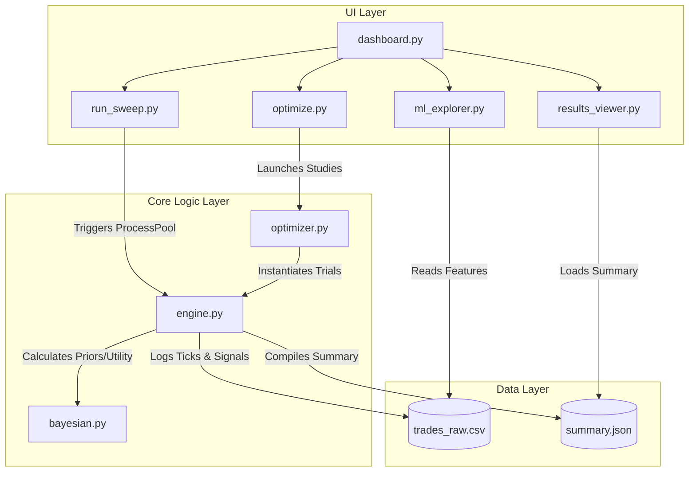

# System Architecture: Standalone Quantitative Backtester App

This document defines the high-level architecture, module breakdown, and data interfaces for the Standalone Backtester Application. The project is housed under the [backtester_app](file:///c:/v3/OTC_SNIPER/backtester_app) directory.

---

## 1. Directory Structure

```text
backtester_app/
├── Dev_Docs/
│   ├── Architecture.md          # This document
│   └── Roadmap.md               # Milestones and task checklist
├── core/
│   ├── __init__.py
│   ├── engine.py                # Core backtester (ported from unified_engine.py)
│   ├── bayesian.py              # Bayesian Probability & Expected Utility Engine
│   └── optimizer.py             # Optuna Strategy Optimization Engine
├── ui/
│   ├── __init__.py
│   ├── dashboard.py             # Streamlit main application entry point
│   └── tabs/
│       ├── __init__.py
│       ├── run_sweep.py         # Tab: Single/Bulk Backtest Sweeps
│       ├── optimize.py          # Tab: Optuna Strategy Calibration
│       ├── results_viewer.py    # Tab: Plotly performance metrics
│       └── ml_explorer.py       # Tab: Bayesian distributions & ML correlations
├── configs/                     # Local storage for strategy profile JSONs
├── requirements.txt             # Project dependencies (streamlit, optuna, plotly, pandas, numpy)
└── run.ps1                      # Helper script to launch the Streamlit server
```

---

## 2. Core Modules & Interactions



### 2.1 UI Layer (`ui/`)
*   **`dashboard.py`**: Streamlit initialization file. Configures page titles, custom theme settings (premium dark-mode colors), sidebar controls, and loads active tabs.
*   **`tabs/run_sweep.py`**: Interacts with the tick database, lets the user select JSON configurations, adjusts logical worker threads, and launches processes.
*   **`tabs/optimize.py`**: Exposes parameters for Optuna sweeps, sets study objectives, and prints real-time updates as studies improve.
*   **`tabs/results_viewer.py`**: Draws Plotly charts showing P/L curves, timezone blocks, and pocket heatmaps.
*   **`tabs/ml_explorer.py`**: Visualizes the PDF curves of Bayesian probability states and correlation tables.

### 2.2 Core Logic Layer (`core/`)
*   **`engine.py`**: Orchestrates tick replay. Steps through price series, runs pre-filters (Kalman), updates indicator states (OTEO), computes pocket states, checks timeframe offsets, and invokes the Bayesian engine.
*   **`bayesian.py`**: Holds stateful Bayesian estimators. Evaluates the probability of success for entries, updates beta parameters on trade outcomes, and calculates optimal fractions.
*   **`optimizer.py`**: Defines the search spaces for trials. Tracks best configurations and returns optimal profile parameters.

---

## 3. Data Interfaces & Math Specification

### 3.1 Bayesian Beta-Binomial Update Math
For each Spike Pocket state $S$ and Expiry $E$, we maintain a Beta distribution modeling the win probability $p$:
*   **State Model**: $P(p \mid \alpha, \beta)$ where $\alpha$ represents wins + prior, $\beta$ represents losses + prior.
*   **Prior Initialization**: $\alpha_0 = 2, \beta_0 = 2$.
*   **Update Rule**:
    $$(\alpha_{t+1}, \beta_{t+1}) = \begin{cases} (\alpha_t + 1, \beta_t) & \text{on Win} \\ (\alpha_t, \beta_t + 1) & \text{on Loss} \end{cases}$$
*   **Credible Interval**: Computed using the cumulative distribution function (CDF) of the Beta distribution:
    $$\int_{0.5208}^{1} \frac{x^{\alpha-1}(1-x)^{\beta-1}}{\mathrm{B}(\alpha, \beta)} dx \ge 1 - \delta$$
    where $\delta = 0.10$ (representing 90% confidence that the win probability beats the breakeven rate of 52.08%).

### 3.2 Expected Utility Trade Sizing
Using the power utility function $U(w) = \frac{w^{1-\gamma}}{1-\gamma}$ where $\gamma$ is risk aversion (default: 2.0):
$$\mathbb{E}[U(w_0 + f \cdot \text{payout})] = p \cdot U(w_0 + f \cdot \text{payout}) + (1 - p) \cdot U(w_0 - f)$$
*   **Action Rule**: Veto execution if maximum expected utility occurs at $f \le 0$ (meaning the trade represents negative expectation or too much uncertainty).
