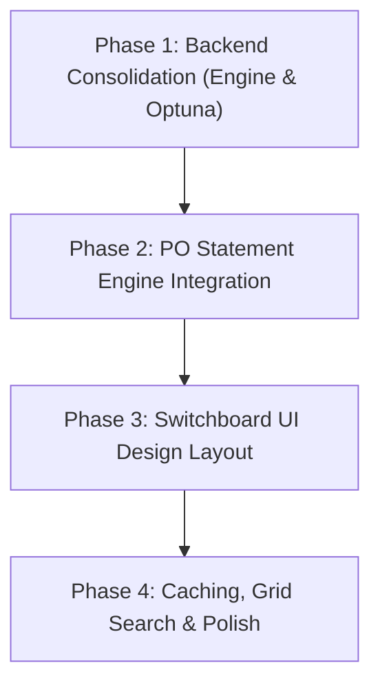

# Refactoring Implementation Plan: Standalone Quantitative Backtester App (`backtester_app`)

This plan outlines a complete refactoring of the Standalone Quantitative Backtester Dashboard into a clean, modular, **Switchboard-style layout**. It focuses on ruthless simplification, removing redundant files/tabs, unifying execution modes, and decoupling the UI from the execution engines.

---

## 1. Executive Summary: Current Architecture Pain Points

The current standalone backtester application has accumulated features organically, resulting in several architectural and UX issues:

*   **Tabs Split & Disconnected State:** Running a sweep (Tab 1), viewing results (Tab 3), and exploring ML features (Tab 4) are separated into disconnected tabs. The user must manually run a sweep, wait, switch tabs, select the report, and click load. There is no unified session memory or shared cache.
*   **Duplicate Configuration Paths:** Configurations are stored across `configs/` and `backtester_app/configs/`. The UI logic loads from one, but some scripts reference another, leading to path resolution conflicts.
*   **Optuna Engine Redundancy:** `backtester_app/core/optimizer.py` implements its own objective function that replicates the trade execution, P&L calculations, and outcomes logic from `backtester_app/core/engine.py`. This duplicate logic creates maintenance debt.
*   **Scattered Veto Gates:** Veto rules (Hurst, OU, Timeframe, Pockets) are implemented as hardcoded nested conditions in `engine.py`. They should be abstracted into modular, registerable filter gates.
*   **CLI vs. UI Disconnect:** The Pocket Option statement replay logic exists only as a standalone script (`replay_po_statement_temporal.py`), completely separated from the Streamlit UI, preventing users from visualising statement replays.

---

## 2. Proposed Architecture & Folder Structure

The refactored app enforces a strict separation of concerns:
1.  **Core Engines (Pure Python):** Exposes clean APIs for backtesting signals (`engine.py`), running Optuna studies (`optimizer.py`), statement replays (`statement_replayer.py`), and mathematical models (`bayesian.py`).
2.  **UI Front-End (Streamlit):** Light, declarative files focused solely on layout, input state, and Plotly rendering.

```
backtester_app/
├── core/
│   ├── __init__.py
│   ├── engine.py          # Unified signal backtester engine (UI-agnostic)
│   ├── optimizer.py       # Optuna calibrator wrapping core engine objectives
│   ├── bayesian.py        # Bayesian prior & sizing/utility calculations
│   └── statement.py       # [NEW] PO Statement Replay engine (rebuilt from CLI script)
├── ui/
│   ├── __init__.py
│   ├── dashboard.py       # Main app shell & sidebar configuration
│   └── tabs/
│       ├── __init__.py
│       ├── switchboard.py  # [NEW] Unified control center (Params, Sweep, Optuna)
│       ├── results.py      # [NEW] Comparative results, equity curve caching & Plotly charts
│       ├── explorer.py     # [NEW] Merged Bayesian PDF & continuous features explorer
│       └── datasets.py     # [NEW] Merged Tick Import & PO Excel Statement upload
├── configs/               # Unified JSON configuration folder at REPO_ROOT/configs/
└── requirements.txt       # Dependencies (Streamlit, Optuna, Plotly, Pandas, Scipy)
```

---

## 3. The Switchboard UI Design

The central interface is redesigned as a unified split-pane dashboard:

```
+---------------------------------------------------------------------------------------------------+
| 🎯 OTC SNIPER — STANDALONE QUANTITATIVE BACKTESTER & CALIBRATION CENTER                           |
+---------------------------------------------------------------------------------------------------+
| [ TAB: SWITCHBOARD CONTROL ]   [ TAB: COMPARATIVE RESULTS ]   [ TAB: EXPLORER ]   [ TAB: DATA ]   |
+---------------------------------------------------------------------------------------------------+
|  LEFT PANE: SWITCHBOARD PARAMETERS         |  RIGHT PANE: EXECUTION & DYNAMIC CACHING             |
|                                            |                                                      |
|  -- STACK PRESETS --                       |  -- EXECUTION TARGET --                              |
|  [ Preset Dropdown: "Kalman + OU + Bayes" ]|  Asset: [ AUDNZD_otc v ]  Dates: [ 2026-06-25, 26 v ]|
|                                            |  Payout %: [ 92.0 ]       Data Type: (•) Ticks ( ) PO|
|  -- ACTIVE FILTERS SWITCHBOARD --          |                                                      |
|  [x] OTEO L3 Baseline (Default Active)     |  -- MODE SELECTOR --                                 |
|                                            |  (•) Single Run  ( ) Grid Sweep  ( ) Optuna Calibrate|
|  [x] Kalman Smoother                       |                                                      |
|      Q: [ 1e-9   ]  R: [ 1e-7   ]          |  [ BUTTON: RUN EXECUTION STACK ]                     |
|                                            |                                                      |
|  [x] Ornstein-Uhlenbeck (OU) Veto          |  -- LIVE PERFORMANCE (CURRENT VS. CACHED STACK A) -- |
|      Mode: [ Kalman v ]  Beta Q: [ 1e-6 ]  |  Metric        Current Run     Cached Stack A        |
|                                            |  Win Rate      54.80%          50.32%  (+4.48%)      |
|  [x] Bayesian Credible Gate                |  Trades        208             1168                  |
|      Threshold: [ 0.90 ]  Breakeven: [0.52]|  P&L (Units)   +123.5          -240.0                |
|                                            |                                                      |
|  [x] Volatility Adaptive Expiry            |  -- COMPARATIVE EQUITY CURVES --                     |
|      C: [ 10.0   ]  Bounds: [30, 60, 120]  |   $ |                                   / (Current)   |
|                                            |     |                                  /              |
|  [ ] Hurst Exponent Gate (Suspended)       |     |   ______________________________/____ (Stack A)   |
|      Min H: [ 0.44 ]  Max H: [ 0.58 ]      |     +----------------------------------------> t     |
|                                            |  [ BUTTON: CACHE CURRENT STACK AS REFERENCE A ]      |
+---------------------------------------------------------------------------------------------------+
```

### A. Switchboard Component Details
1.  **Stack Presets:** Standardizes commonly used configurations. Selecting a preset instantly toggles the switches and fills sliders to matching thresholds.
    *   *Baseline L3:* Only OTEO level 3 active.
    *   *Kalman + OU Veto:* OTEO L3 + Kalman smoothing + OU trending veto.
    *   *Dynamic Volatility Adaptive:* OTEO L3 + Kalman + OU + Volatility Adaptive expiry.
    *   *The Ultimate Stack:* Kalman + OU + Volatility Adaptive + Bayesian Gate.
2.  **Filter Toggle Matrix:** Expandable toggle rows for each math filter containing their specific parameters. Filters that are turned off are automatically bypassed by the core engine.
3.  **Mode Selector:**
    *   *Single Run:* Runs the current switchboard configuration on selected dates.
    *   *Grid Sweep:* Executes a fast parametric grid search over checked variables (displays a Plotly heatmap of parameter pairs).
    *   *Optuna Calibrate:* Runs Optuna study to find optimal parameters for checked filters only (others are frozen to current slider values).
4.  **Data Source Selector:** Toggles between simulating entries on tick logs or replaying real Pocket Option statement records.
5.  **Side-by-Side Cache Viewer:** Streams live backtest results, allows caching the run to session memory, and overlaying the equity curves of the current stack against the cached reference.

---

## 4. Step-by-Step Refactoring Implementation Plan

We will proceed in 4 sequential phases, keeping changes focused and maintaining a runnable dashboard at each stage.



### Phase 1: Backend Consolidation (Core Engine Cleanup)
*   **Goal:** Modularize `backtester_app/core/engine.py` and remove duplicate logic in `optimizer.py`.
*   **Tasks:**
    1.  Clean up `UnifiedBacktestConfig` to match the exact switchboard parameter structure.
    2.  Refactor `UnifiedBacktester.run_file` to structure filters as a pipeline of registerable gates:
        ```python
        self.gates = [
            KalmanFilterGate(self.config.kalman),
            HurstFilterGate(self.config.hurst),
            OUFilterGate(self.config.ou),
            TimeframeFilterGate(self.config.timeframe),
            PocketFilterGate(self.config.pocket),
            BayesianFilterGate(self.config.bayesian),
        ]
        ```
    3.  Rewrite `backtester_app/core/optimizer.py` to import `UnifiedBacktester` directly and use its outcomes inside the Optuna objective function rather than duplicating raw tick looping.
*   **Estimated Effort:** 4 hours

### Phase 2: PO Statement Engine Integration
*   **Goal:** Rebuild the temporal statement replayer into `backtester_app/core/statement.py` as an importable module.
*   **Tasks:**
    1.  Create `backtester_app/core/statement.py` using optimized, early-breakout tick looping.
    2.  Ensure it accepts a `UnifiedBacktestConfig` object so it uses the exact same filter definitions as the signal backtester.
    3.  Expose `run_statement_replay` returning structured results (win rates, trades, P&L, day/hour summaries) compatible with Plotly.
*   **Estimated Effort:** 3 hours

### Phase 3: Switchboard UI Layout Implementation
*   **Goal:** Redesign the Streamlit front-end with the split-pane Switchboard design.
*   **Tasks:**
    1.  Consolidate `dashboard.py` to only contain structural tab definitions.
    2.  Implement `ui/tabs/switchboard.py` containing:
        *   Switchboard toggles, sliders, and presets dropdown (Left Column).
        *   Execution target settings, mode selector, and the "Run" trigger button (Right Column).
    3.  Unify directory paths to read/write JSON configs exclusively from the top-level `/configs` folder.
*   **Estimated Effort:** 5 hours

### Phase 4: Caching, Comparison Sheets & Polish
*   **Goal:** Implement comparative results and clean up obsolete files.
*   **Tasks:**
    1.  Add a session-state cache list in `ui/tabs/results.py` to hold historical run performance results.
    2.  Update the equity curve rendering to plot multiple cached runs together.
    3.  Delete all deprecated, overlapping tab files (`run_sweep.py`, `optimize.py`, `import_data.py`).
    4.  Verify the installation of `QuFLX-v2` dependencies.
*   **Estimated Effort:** 3 hours

---

## 5. Features to Remove or Merge

| File / Tab | Status | Action / Replacement |
|---|---|---|
| `backtester_app/ui/tabs/run_sweep.py` | **DEPRECATED** | Merged into `switchboard.py` (Single Run mode). |
| `backtester_app/ui/tabs/optimize.py` | **DEPRECATED** | Merged into `switchboard.py` (Optuna Calibrate mode). |
| `backtester_app/ui/tabs/import_data.py` | **MERGED** | Replaced by `datasets.py` (handles tick log conversion and PO statement upload). |
| `backtester_app/ui/tabs/results_viewer.py` | **UPGRADED** | Replaced by `results.py` with comparative caching. |
| Duplicate `configs/` folders | **REMOVED** | Delete `backtester_app/configs/` entirely. Use `configs/` at workspace root. |

---

## 6. Naming Conventions & Best Practices

To maintain code cleanliness going forward, enforce the following standards:

### Config Naming Conventions
*   **Presets Files:** `preset_l3_baseline.json`, `preset_kalman_ou.json`, `preset_ultimate_stack.json`.
*   **Calibrated Configs:** `opt_[asset]_[metric]_[date].json` (e.g., `opt_eurusd_winrate_2026-06-30.json`).

### Coding Best Practices
*   **Bypass Flag Rule:** Every filter class must expose a boolean toggle (`enabled`). If `False`, the gate must immediately return `True` (allowing the trade) with negligible CPU overhead.
*   **Single-Source Truth for Math:** Calculations for metrics like volatility score, returns standard deviation, and win rate must reside in the `core/` engines, never in UI tabs. The UI only formats and displays.
*   **Vectorized Dataframes:** When passing backtest results to Plotly, keep calculations vectorized using Pandas to prevent Streamlit UI freezes on large datasets.
