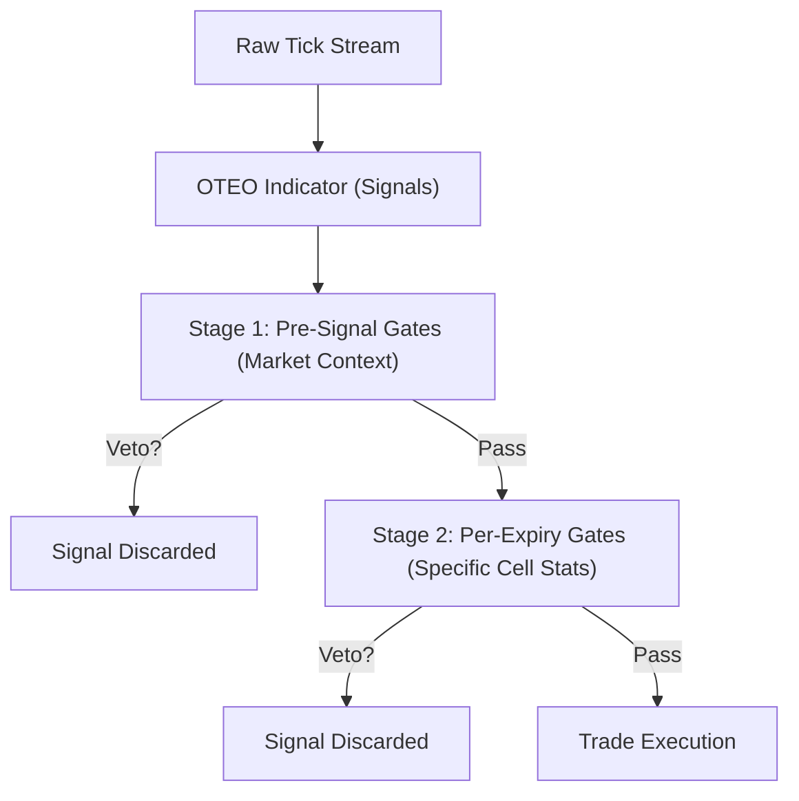

# How it Works: OTC SNIPER Quantitative Filters & Veto Gates

This guide explains the quantitative logic, filter gates, and parameters of the Standalone Backtester App and the Auto Ghost trading engine. 

---

## 1. The Gate Pipeline Architecture

The system processes market tick events and executes trades through a **Sequential Two-Stage Gate Pipeline**. 

Think of this pipeline as a series of physical filters (or sieves) with varying grid sizes. Raw market data flows in, and only the trades that pass every single gate are executed. If any gate triggers a veto, the signal is instantly dropped.

---

## 2. Stage 1: Pre-Signal Gates (Market Context)

Pre-signal gates evaluate the global state of the market when a signal is generated. If the overall environment is too volatile, trending in the wrong direction, manipulated, or in an excluded timeframe, the trade is blocked before looking at specific expiry metrics.

### 🟢 Kalman Filter (Smoother)
- **What it does:** Acts like noise-cancelling headphones for market prices. It filters out high-frequency market micro-noise (random oscillations) to extract the underlying price signal.
- **Under the Hood:**
  It recursively estimates the "true" price ($x_t$) given noisy measurements ($z_t$) using a prediction-update loop:
  $$\hat{x}_{t\mid t-1} = \hat{x}_{t-1\mid t-1}$$
  $$P_{t\mid t-1} = P_{t-1\mid t-1} + Q$$
  $$K_t = \frac{P_{t\mid t-1}}{P_{t\mid t-1} + R}$$
  $$\hat{x}_{t\mid t} = \hat{x}_{t\mid t-1} + K_t(z_t - \hat{x}_{t\mid t-1})$$
  $$P_{t\mid t} = (1 - K_t)P_{t\mid t-1}$$
- **Key Parameters:**
  - **Process Noise Q ($1\times10^{-9}$):** How much we expect the true price system to drift. Lower Q = smoother, slower line.
  - **Measurement Noise R ($1\times10^{-7}$):** How much noise is in the tick stream. Higher R = smoother line, ignores larger price jumps.
  - **Upstream of Hurst:** When enabled, the smoothed Kalman price (instead of the raw price) is fed to the Hurst exponent calculator, removing fractal noise.

### 📊 Hurst Exponent Veto
- **What it does:** Measures the "memory" of a price series, determining its fractal regime.
- **Under the Hood:**
  Calculates the Hurst Exponent ($H$) over a rolling window. $H$ ranges between 0.0 and 1.0:
  - **Mean-Reverting ($H < 0.44$):** Prices behave like a stretched rubber band. Moves away from the mean are highly likely to snap back. Perfect for pocket reversion strategies.
  - **Random Walk ($0.44 \le H \le 0.58$):** Pure noise, random brownian motion. Untradable.
  - **Trending ($H > 0.58$):** Prices have strong momentum. Moves in one direction tend to keep going in that direction. Very dangerous for pocket reversion.
- **Key Parameters:**
  - **Mean-Reverting Limit:** The cutoff below which the market is classified as mean-reverting.
  - **Trend Limit:** The cutoff above which the market is classified as trending.
  - **Allowed Regimes Whitelist:** Select which regimes to trade in. Typically, we whitelist only `["mean_reverting"]` or `["mean_reverting", "random_walk"]` depending on calibration.
  - **Filter Threshold:** Vetoes the signal immediately if raw $H \ge$ threshold.

### 🌀 Ornstein-Uhlenbeck (OU) Veto
- **What it does:** Models the speed of mean reversion. If the market behaves like a rubber band, the OU filter tells us how strong the elasticity is, and vetoes if the band is broken.
- **Under the Hood:**
  Fits price changes to the continuous-time stochastic process:
  $$dx_t = \theta(\mu - x_t)dt + \sigma dW_t$$
  - **Mean Reversion Speed ($\theta$):** How fast the price returns to the mean $\mu$.
  - **Half-Life ($\tau = \ln(2)/\theta$):** The expected time it takes for the price to close 50% of the gap to its mean.
- **Veto Condition:**
  If the Kalman-estimated beta coefficient is positive ($\ge 0$), the price is behaving like an *explosive* process (speeding away from its mean rather than returning). The OU gate triggers an immediate veto.

### 🕰️ Timeframe Exclusion blocks
- **What it does:** Blocks trading during specific times of day.
- **Under the Hood:**
  Splits the 24-hour UTC day into six 4-hour blocks (0 to 5):
  - Block 0: 00:00 - 04:00 UTC
  - Block 1: 04:00 - 08:00 UTC
  - Block 2: 08:00 - 12:00 UTC
  - Block 3: 12:00 - 16:00 UTC
  - Block 4: 16:00 - 20:00 UTC
  - Block 5: 20:00 - 24:00 UTC
- **Veto Condition:** Vetoes if the current transaction time falls inside a blacklisted block (e.g. during market open/close volatility spikes).

### 🚨 Manipulation Gate
- **What it does:** Detects institutional market manipulation, specifically "push-snap" or "pinning" behavior near expiration bars.
- **Under the Hood:**
  Scans recent ticks for artificial liquidity walls, pin behavior, or severe asymmetric jumps. Outputs a severity float from 0.0 (clean) to 1.0 (highly manipulated).
- **Veto Condition:** Vetoes if the severity exceeds the **Severity Threshold** (default: 0.3).

### 📈 ADX/CCI Market Regime Gate
- **What it does:** Classifies structural market states using Classical indicators (ADX trend strength, CCI momentum, and price structure).
- **Under the Hood:**
  Categorizes the market into states: `RANGE_BOUND`, `TREND_PULLBACK`, `TREND_REVERSAL`, `STRONG_MOMENTUM`, `BREAKOUT`, `CHOPPY`.
- **Veto Condition:** Blocks execution if the current regime is not inside the whitelist (e.g., vetoes when market is `BREAKOUT` or `STRONG_MOMENTUM`).

### 🎯 OTEO Signal Gate
- **What it does:** Restricts signals generated by the core OTEO indicator based on statistical intensity.
- **Key Parameters:**
  - **Z-Score Bounds:** Minimum and maximum absolute standard deviations required. Extremely high z-scores represent anomalously fast price moves that might be news-driven and unstable.
  - **Score Bounds:** OTEO confidence score bounds (0.0 to 100.0).

---

## 3. Stage 2: Per-Expiry Gates (Specific Cell Stats)

Once the market context is approved, Stage 2 checks parameters specific to the target trade duration (e.g., 60s, 120s, 300s).

### 🕳️ Spike Pocket Exclusions
- **What it does:** Vetoes specific combinations of Volatility, Liquidity, and Manipulation categories for particular expiries.
- **Under the Hood:**
  The `PocketTracker` categorizes the environment into states:
  - **Volatility:** `Ratio = Fast SD / Slow SD`. Classified as `HIGH`, `MEDIUM`, or `LOW`.
  - **Liquidity:** `Frequency = Ticks per Minute`. Classified as `HIGH`, `MEDIUM`, or `LOW`.
  - **Manipulation:** Classified as `HIGH`, `MEDIUM`, or `LOW`.
  - **Combined State String:** E.g., `Vol:HIGH | Liq:LOW | Manip:MEDIUM`.
- **Veto Condition:**
  A cell key is built as `StateString|Expiry` (e.g., `Vol:HIGH | Liq:LOW | Manip:MEDIUM|60`). If this cell is blacklisted or has poor historical win-rates, it is vetoed.

### 🔮 Bayesian Credible Gate
- **What it does:** Uses probability theory to answer: *"Do we have enough historical proof that this specific pocket state wins at this expiry, or is it just statistical noise?"*
- **Under the Hood (Beta-Binomial Updates):**
  We track wins ($W$) and losses ($L$) for each pocket-expiry cell. We model our uncertainty of the true win rate $p$ using a Beta distribution:
  $$P(p \mid \alpha, \beta) = \frac{p^{\alpha-1}(1-p)^{\beta-1}}{\mathrm{B}(\alpha, \beta)}$$
  - **Prior:** $\alpha_0 = 2$, $\beta_0 = 2$ (representing a weak prior centered at 50% win rate).
  - **Update:** On Win, $\alpha \leftarrow \alpha + 1$. On Loss, $\beta \leftarrow \beta + 1$.
  - **Credible Interval Check:**
    We calculate the probability that the true win rate $p$ is higher than the breakeven rate ($52.08\%$):
    $$\int_{0.5208}^{1} P(p \mid \alpha, \beta) dp \ge \text{Confidence Threshold}$$
- **Veto Condition:** Vetoes if the probability is less than the confidence threshold (e.g., 90%).

### 🔮 Bayesian Expected Utility Sizer
- **What it does:** Determines if a trade has positive expected value under risk-averse conditions.
- **Under the Hood (Power Utility):**
  Uses the power utility function:
  $$U(w) = \frac{w^{1-\gamma}}{1-\gamma}$$
  where $\gamma$ is risk aversion (default: 2.0).
  It calculates the fraction $f$ of our capital to risk that maximizes the expected utility:
  $$\mathbb{E}[U(w_0 + f \cdot \text{payout})] = p \cdot U(w_0 + f \cdot \text{payout}) + (1 - p) \cdot U(w_0 - f)$$
- **Veto Condition:** If the optimal allocation fraction $f \le 0.005$ (meaning negative expected value or high uncertainty), the trade is vetoed.

---

## 4. AI Studio / Nana Banana (Imagen) Image & Video Prompts

To generate stunning educational diagrams or video explanations in Google's AI Studio (using Imagen / video generation models), copy and paste these prompts:

### Image Prompt 1: The Filters Funnel Stack
> **Prompt:** "A sleek, premium 3D design of a digital trading data stream passing through a vertical stack of futuristic, glowing glass filters. The top filter is labeled 'Kalman noise filter' and shines green, the second is 'Hurst regime gate' glowing cyan, the third is 'Manipulation veto gate' glowing red, and the final filter is a glowing neon purple mesh labeled 'Bayesian probability gate'. Successful trade signals emerge from the bottom as golden spheres. High-tech, dark mode aesthetic, dark background, cinematic lighting, ultra-detailed."

### Image Prompt 2: Hurst Exponent Analogy
> **Prompt:** "A stylized illustration explaining three fractal market regimes side-by-side. 1. Mean Reverting: a ping pong ball trapped in a curved neon-blue bowl, bouncing back to the center. 2. Random Walk: a winding white noise wave path representing pure uncertainty. 3. Trending: a powerful yellow rocket blasting upwards leaving a straight vector path. Modern dashboard infographic style, dark theme, clean typography."

### Video/Animation Prompt: The Bayesian Update Process
> **Prompt:** "An educational animation showing a mathematical bell-curve (Beta distribution) on a dark digital grid. Initially, the curve is wide and flat, centered at 0.5. As golden binary symbols representing wins and losses drop into the curve, the curve dynamically shifts to the right and squeezes, becoming taller and narrower, centered at 0.6. A vertical red dashed line labeled 'Breakeven 52%' stands stable as the curve shifts past it, filling the right side with glowing green light."
